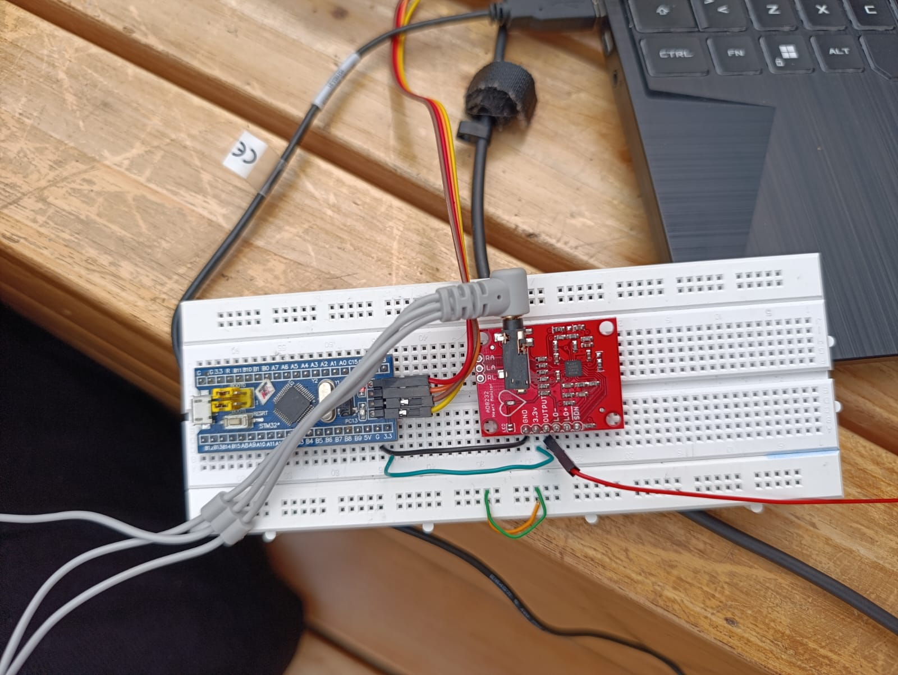
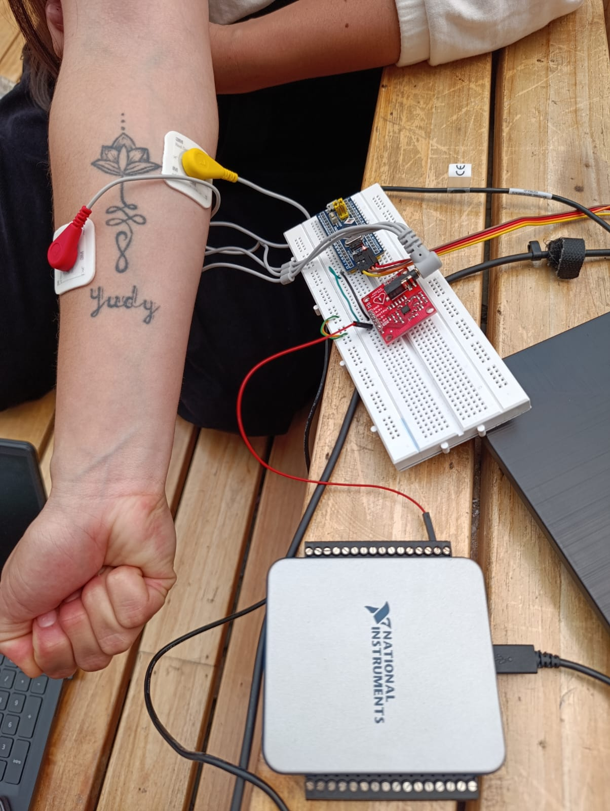
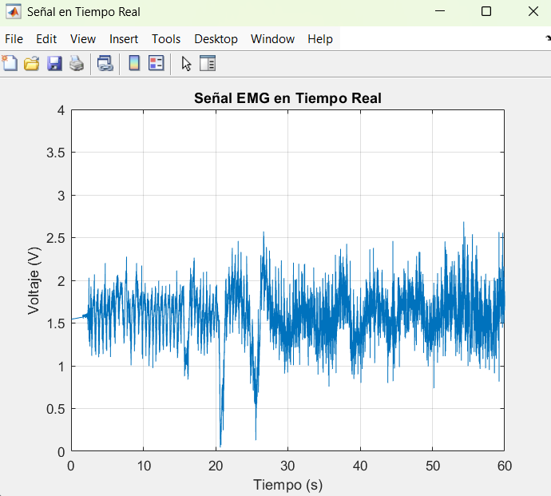

# PDS_LAB4 

Para la presente práctica se tuvo como objetivo la toma y análisis de una señal electromiográfica (EMG), la cual se tomo por medio de electrodos, para ser posteriormente analisados por un DAQ cuyos datos seran tomados y guardados a partir de la programación en un código de Matlab, dichos datos a su vez seran posteriormente analisados por medio de un código de phyton que nos brindara información sobre su frecuencia y una comparativa gráfica entre la señal original y otra a la cual se le fueron aplicados filtros para un análisis más preciso del mismo, así como un análsis estadísticos de los datos finales. Todo lo anterior se explicará más a fondo a continuación.

## 1. CIRCUITO Y UBCACIÓN ELECTRODOS

## 2. TOMA Y GUARDADO SEÑALES EMG EN MATLAB

### a. Configuración del DAQ

    device = 'Dev5';          % Nombre DAQ
    channel = 'ai0';          % Canal entrada
    sampleRate = 1000;        % Frecuencia muestreo
    tiempo_muestras = 60;     % Duración
    archivo_salida = 'emgsignall.csv';  % Archivo salida

    d = daq ("ni");                                
    addinput(d, device, channel, "voltaje");  %Agregar Canal
    d.Rate = sampleRate;

Primero, iniciamos definiendo los parámetros básicos para la adquisición de datos por parte de los electrodos, donde "Dev4" identifica el DAQ y "ai0" se refiere al canal analógico de entrada del mismo; adicionalmente, se delimitó la frecuencia de muestreo en 1kHz, valor que es óptimo teniendo en cuenta las altas frecuencias de la actividad muscular en nuestro cuerpo; tras esto se delimito la toma de datos a un minuto y el archivo "emg_signal" es el encargado de integrar los datos en ese minuto; por último, "addinput" configura nuestro canal seleccionado para medir el voltaje.

### b. Variable y Gráfica en tiempo real

    %Variables
    timedata = [];     %Almacenar datos tiempo
    signaldata = [];   %Almacenas datos de señal

    %Gráfica
    figure ('EMG', 'Señal Tiempo Real', 'Number Title', 'off');
    h = plot(NaN, Nan);
    xlabel('Tiempo [s]');
    ylabel('Voltaje [V]');
    title('Señal EMG Tiempo Real');
    xlim([0, duration]);
    ylim([0, 4]);          %Ajuste rango voltaje
    grid on;

    disp('Iniciando Adqusisicion');
    atarTime = datatime('now');

Las variables creadas (time - signal), sirven para almacenar tanto los datos temporales como los de amplitud. Una vez definidas, se prepara la visualización dinámica, cabe resaltar límites de rango, ya que si es demasiado grande podria o pequeña podria generar una dificultad en la visualización de la señal tomada. Tal como se muestra en la imágen se muestra se ven llos rangos de lo ejes estaablecidos con anterioridad, junto con la señal EMG tomada por los electrodos.

### c . Bucle de Adquisición y Guardado de Datos

    while seconds (datatime('now') - startTime) < tiempo_muestras

    %Leer Muestra
    [data, timestamp] = read(d, "OutputFormat", "Matrix");

    %Guardar Datos
    t = seconds(datatime ("now") - startTime);
    timeVec = [timeVec; t];
    signalVec = [signalVec; data];

    %Actualizar Gráfica
    set(h, 'XData', timeVec, 'YData', signalVec);
    drawshow;

    end

    %Guardar Datos
    disp('Adquisicion Finalizada. Guardando');
    T = table(timeVec, signalVec, 'VariableNames', {'Tiempo [s]', 'Voltaje [mV]'});
    writetable(T, outputFile);
    disp(['Datos Guardados en: ', outputFile]);

    clear d;

Se prosigue con un bucle de un minuto, valor establecido en la configuración, donde se capturan los datos en un formato matricial, en donde se calcula el tiempo transcurrio con "datetime", almacenando los datos de los vectores; junto con las actualizaciones dinámicas permite el monitoreo de la señal en tiempo real, sin retrasos. Al final, los datos se guardan en una tabla excel de nombre "emg_signal.csv", delimitando los tiempos y voltajes en columnas respectivamente, el uso de "writetable" permite la compatibilidad con excel tanto con phyton, para su posterior análsis.

## 3. PROGRAMACIÓN PYTHON: ANÁLISIS, FILTRADO Y GRAFICACIÓN DE SEÑAL

## 4. ANÁLISIS ESTADÍSTICO DE LA SEÑAL

